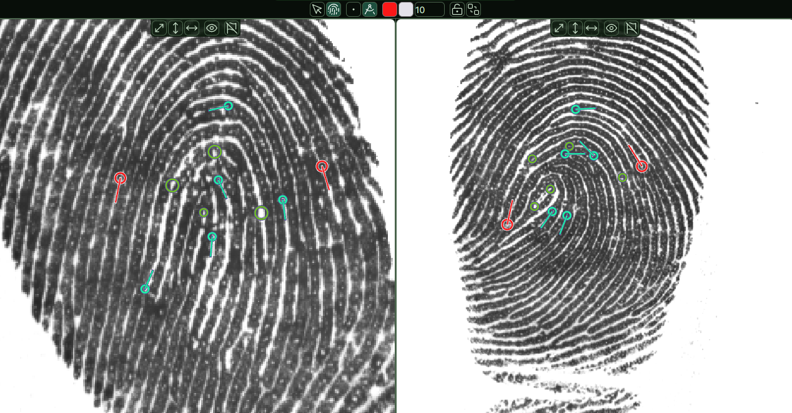

= bioparallel

Application for forensic trace comparison

== Development

=== Pre-requisites

First, you need to have https://beta.tauri.app/guides/prerequisites/[Tauri] installed (v2 beta at the time of writing)

Then just run the following commands to start the app:

....
git clone https://github.com/shipurjan/bioparallel.git
cd bioparallel
pnpm i
pnpm tauri dev
....

NOTE: Sometimes you may need to run `pnpm tauri dev` a few times to start the app. If you get an error, just run the command again.